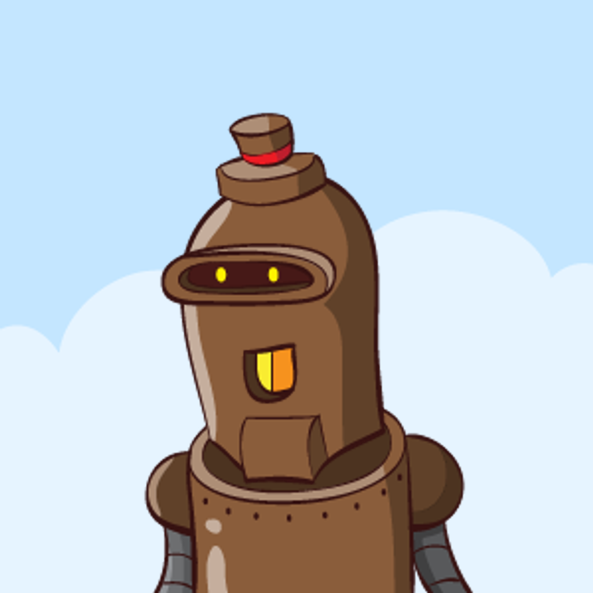

[![Contributors][contributors-shield]][contributors-url]
[![Forks][forks-shield]][forks-url]
[![Stargazers][stars-shield]][stars-url]
[![Issues][issues-shield]][issues-url]
[![MIT License][license-shield]][license-url]

<br />
<div align="center">
  <a href="https://github.com/Continuum-AI-Inc/continuum-avatars">
    
  </a>

<h3 align="center">Continuum Avatars</h3>

  <p align="center">
    Open source avatar generator based on <a href="https://robohash.org/">robohash</a> implemented in TypeScript.
    <br />
    <a href="https://continuum-ai.de/docs/avatars"><strong>Explore the docs »</strong></a>
    <br />
    <br />
		<a href="https://continuum-ai.de/projects/avatars">View Demo</a>
    ·
    <a href="https://github.com/Continuum-AI-Inc/continuum-avatars/issues">Report Bug</a>
    ·
    <a href="https://github.com/Continuum-AI-Inc/continuum-avatars/issues">Request Feature</a>
  </p>
</div>

## Contents

- [Contents](#contents)
- [About The Project](#about-the-project)
- [Getting Started](#getting-started)
- [Roadmap](#roadmap)
- [Contributing](#contributing)
- [License](#license)
- [Contact](#contact)

## About The Project

Continuum Avatars is an open-source avatar generator inspired by the [robohash](https://robohash.org/) project, designed to provide diverse, customizable avatars for various applications. We offer a range of features, including personalization, scalability, and easy integration. Our community-driven project welcomes contributors from around the world, making it a versatile and evolving tool for creating unique avatars. Join us to explore the possibilities of Continuum Avatars and unleash your creativity.

## Getting Started

Getting Started with Continuum Avatars

Creating unique avatars with Continuum Avatars is a simple process, and you can easily integrate it into your Node.js projects using our package, "@continuum-ai/avatars". Here's how to get started:

1. **Install the Package**:
   
   Begin by installing the "@continuum-ai/avatars" package into your Node.js project. You can do this using npm or yarn:

   ```bash
   npm install @continuum-ai/avatars
   # or
   bun add @continuum-ai/avatars
   ```

	 Make sure that `sharp` is installed, if it isn't you'll get a warning and will have to execute a command similar to this one:

	 ```bash
	 npm install --platform=linux --arch=x64 sharp
	 ```

2. **Import the Module**:

   In your application, import the Continuum Avatars module:

   ```typescript
   import { Avatar, AvatarType, BackgroundType } from "@continuum-ai/avatars"
   ```

3. **Generate an Avatar**:

   Now, you can use the module to generate avatars with ease. Simply call the `assemble` method, providing customization options as parameters. Here's a basic example:

   ```typescript
   const avatar = Avatar.assemble("my.email@provider.com", AvatarType.Robot, BackgroundType.Landscape);
   ```

4. **Use the Avatar**:

   You can use the generated avatar in your application as needed. This could involve displaying it in user profiles, chat applications, or any other context where avatars are required.

   ```typescript
	// Convert the "sharp" object to a buffer
	const buffer = await avatar.toBuffer();

	fs.writeFileSync("./avatar.png", buffer);
   ```

5. **Explore Advanced Customization**:

   Continuum Avatars offers advanced customization options beyond the basic example provided here. Check out our [documentation](https://continuum-ai.de/docs/avatars) for in-depth guidance on creating avatars that match your project's requirements.

Join the Continuum Avatars Community:

We invite you to join our community of developers and enthusiasts. Share your avatar creations, seek assistance, and contribute to the project's development on our GitHub repository. We value your input and creativity!

<!-- ROADMAP -->
## Roadmap

- [ ] Advanced customization (de-selecting layers)
- [ ] Output shape customization
- [ ] Additional Character-sets
  - [ ] Semi-Realistic Humans
  - [ ] Drawings
  - [ ] Modern 2.5D Illustrations

See the [open issues](https://github.com/Continuum-AI-Inc/continuum-avatars/issues) for a full list of proposed features (and known issues).

## Contributing

Contributions are what make the open source community such an amazing place to learn, inspire, and create. Any contributions you make are **greatly appreciated**.

If you have a suggestion that would make this better, please fork the repo and create a pull request. You can also simply open an issue with the tag "enhancement".
Don't forget to give the project a star! Thanks again!

1. Fork the Project
2. Create your Feature Branch (`git checkout -b feature/AmazingFeature`)
3. Commit your Changes (`git commit -m 'Add some AmazingFeature'`)
4. Push to the Branch (`git push origin feature/AmazingFeature`)
5. Open a Pull Request

## License

Distributed under the MIT License. See `LICENSE.txt` for more information.

## Contact

Moritz Utcke - <info@continuum-ai.de>

Project Link: [https://github.com/Continuum-AI-Inc/continuum-avatars](https://github.com/Continuum-AI-Inc/continuum-avatars)

<!-- MARKDOWN LINKS & IMAGES -->
<!-- https://www.markdownguide.org/basic-syntax/#reference-style-links -->
[contributors-shield]: https://img.shields.io/github/contributors/Continuum-AI-Inc/continuum-avatars.svg?style=for-the-badge
[contributors-url]: https://github.com/Continuum-AI-Inc/continuum-avatars/graphs/contributors
[forks-shield]: https://img.shields.io/github/forks/Continuum-AI-Inc/continuum-avatars.svg?style=for-the-badge
[forks-url]: https://github.com/Continuum-AI-Inc/continuum-avatars/network/members
[stars-shield]: https://img.shields.io/github/stars/Continuum-AI-Inc/continuum-avatars.svg?style=for-the-badge
[stars-url]: https://github.com/Continuum-AI-Inc/continuum-avatars/stargazers
[issues-shield]: https://img.shields.io/github/issues/Continuum-AI-Inc/continuum-avatars.svg?style=for-the-badge
[issues-url]: https://github.com/Continuum-AI-Inc/continuum-avatars/issues
[license-shield]: https://img.shields.io/github/license/Continuum-AI-Inc/continuum-avatars.svg?style=for-the-badge
[license-url]: https://github.com/Continuum-AI-Inc/continuum-avatars/blob/master/LICENSE.txt
